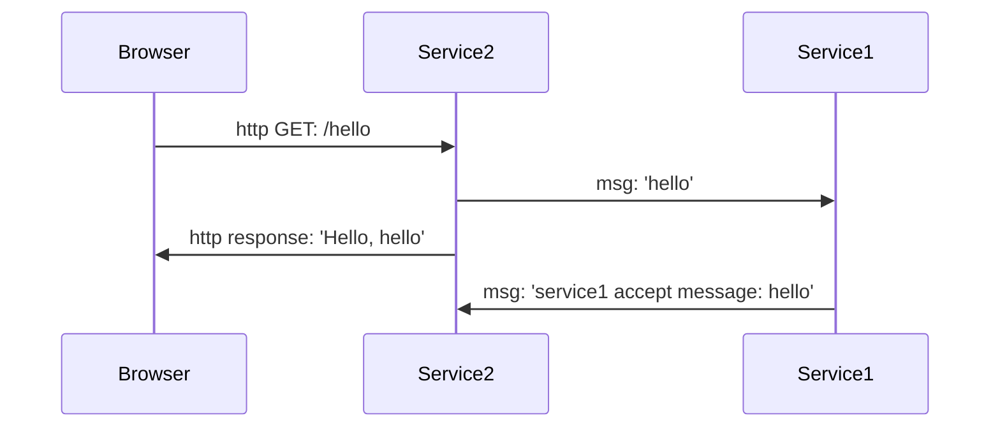

# Пример с FastStream - Redis

- [FastStream](https://github.com/airtai/faststream) - фреймворк для работы с брокерами сообщений
- [Redis](https://github.com/redis/redis) - in-memory база данных и брокер сообщений

## Подготовка

1. Клонируем проект
    ``` PowerShell
    git clone https://github.com/IldarGaleevSkyProHomeworks/fast_stream_example.git
    cd .\fast_stream_example\
    ```

2. Ставим зависимости для `Service1`
    ``` PowerShell
    cd .\Service1\
    python -m venv venv
    .\venv\Scripts\activate
    pip install -r requirements.txt
    deactivate
    cd ..
    ```

3. Ставим зависимости для `Service2`
    ``` PowerShell
    cd .\Service2\
    python -m venv venv
    .\venv\Scripts\activate
    pip install -r requirements.txt
    deactivate
    cd ..
    ```
4. Ставим и запускаем `Redis`
    - [WSL](https://redis.io/docs/install/install-redis/install-redis-on-windows/)
    - [Portable версия для Windows](https://github.com/redis-windows/redis-windows)

## Запуск

> [!NOTE]
>
> Каждый сервис в своем окне терминала

1. Запуск первого сервиса:

    ```PowerShell
    .\Service1\venv\Scripts\faststream.exe run Service1\service1:app
    ```
    или

    ```PowerShell
    cd .\Service1\
    .\venv\Scripts\activate
    faststream run service1:app
    ```
2. Запуск второго сервиса

    ```PowerShell
    .\Service2\venv\Scripts\python.exe .\Service2\service2.py
    ```

    или

    ```PowerShell
    cd .\Service2\
    .\venv\Scripts\activate
    python .\service2.py
    ```

## Работа с примером

Теперь, после запуска обоих сервисов, можно из браузера сделать запрос:

```
http://localhost:8000/hello
```

Теперь в браузере мы должны увидеть страницу с текстом:
```
Hello, hello
```

В окне терминала `service2.py`

```
2024-02-18 03:15:56,115 INFO     - service2 | 9637ad9b-afdd-4 - Received
service1 accept message: hello
2024-02-18 03:15:56,116 INFO     - service2 | 9637ad9b-afdd-4 - Processed
```

А в окне терминала `service1.py`

```
2024-02-18 03:15:56,109 INFO     - service1 | 10d2e613-adf1-4 - Received
received: hello
2024-02-18 03:15:56,115 INFO     - service1 | 10d2e613-adf1-4 - Processed
```

## Так... и что произошло?


